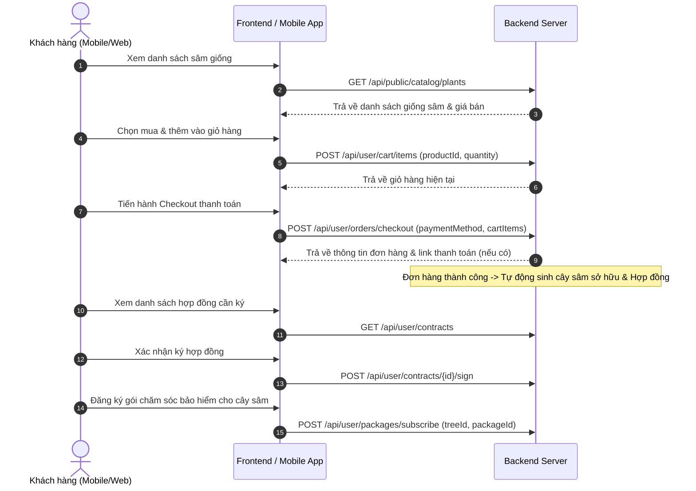
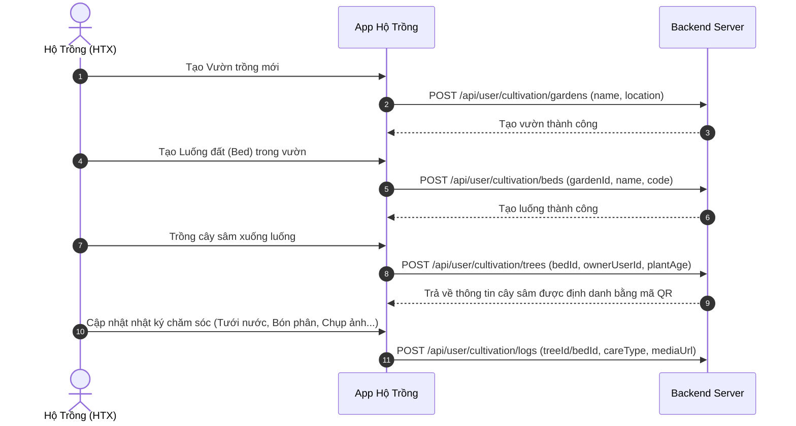
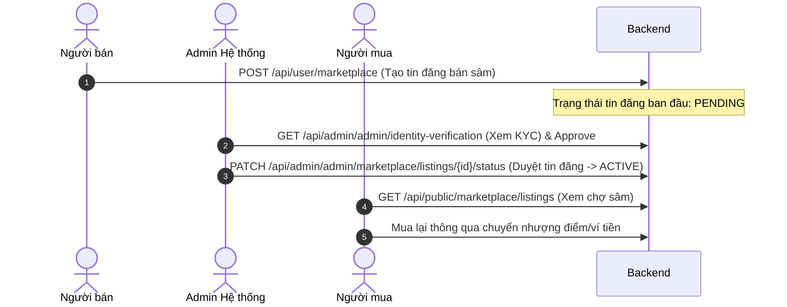

# 📋 Kịch Bản Nghiệp Vụ Tích Hợp Hệ Thống (Frontend/Mobile - Backend)

Tài liệu này hướng dẫn chi tiết các kịch bản nghiệp vụ (Business Workflows) tuần tự để đội ngũ phát triển Frontend (Web) và Mobile (App) biết cách gọi chuỗi các API kết nối thành các luồng hoàn chỉnh của hệ thống **Sâm Ngọc Linh**.

---

## 🛠️ Luồng 1: Mua Sâm Giống & Đăng Ký Gói Chăm Sóc (B2C)
*Kịch bản: Khách hàng mua cây sâm giống từ hệ thống, ký hợp đồng điện tử và chọn dịch vụ chăm sóc hộ.*

### Chi tiết các bước gọi API:
1. **Lấy danh mục sâm giống công khai:**
   * **API:** `GET /api/public/catalog/plants`
   * **FE xử lý:** Hiển thị hình ảnh, tên giống sâm, tuổi sâm (ví dụ: sâm 2 năm tuổi, 4 năm tuổi) và đơn giá.
2. **Thêm sâm giống vào giỏ hàng:**
   * **API:** `POST /api/user/cart/items`
   * **Payload:** `{ "productId": "id_sam_giong", "quantity": 5 }` (ví dụ: mua 5 cây).
3. **Thanh toán đơn hàng (Checkout):**
   * **API:** `POST /api/user/orders/checkout`
   * **Payload:** `{ "address": "Hà Nội", "paymentMethod": "banking" }`
   * **Lưu ý:** Backend sẽ tự động gọi API cài đặt để lấy `shipping_fee` cộng vào đơn hàng.
4. **Ký Hợp đồng Điện tử:**
   * **API:** `GET /api/user/contracts` để liệt kê các hợp đồng mua bán cây giống.
   * **Ký kết:** `POST /api/user/contracts/{id}/sign` để xác nhận quyền sở hữu cây sâm điện tử.
5. **Đăng ký gói chăm sóc:**
   * **API:** `POST /api/user/packages/subscribe`
   * **Payload:** `{ "treeId": "cây_sâm_vừa_mua", "packageId": "gói_chăm_sóc_đặc_biệt" }` để liên kết dịch vụ chăm sóc với cây sâm.

---

## 🚜 Luồng 2: Hộ Trồng Ghi Nhận Nhật Ký Canh Tác (Hộ Trồng / Hợp Tác Xã)
*Kịch bản: Hộ trồng tạo luống sâm, trồng cây của khách hàng xuống đất và cập nhật nhật ký chăm sóc định kỳ.*

### Chi tiết các bước gọi API:
1. **Đăng ký vườn và luống:**
   * **Tạo vườn:** `POST /api/user/cultivation/gardens` -> Payload: `{ "name": "Vườn sâm HTX Măng Ri 1", "location": "Kon Tum" }`
   * **Tạo luống:** `POST /api/user/cultivation/beds` -> Payload: `{ "gardenId": "garden_id", "name": "Luống A1", "code": "L-A1" }`
2. **Khai báo trồng cây giống thực tế:**
   * **API:** `POST /api/user/cultivation/trees`
   * **Payload:** `{ "bedId": "bed_id", "ownerUserId": "id_khach_hang_mua_sam", "tagNumber": "QR-SAM-9999" }`
3. **Cập nhật nhật ký chăm sóc:**
   * **API:** `POST /api/user/cultivation/logs`
   * **Payload:** `{ "treeId": "tree_id", "actionType": "watering", "notes": "Đã tưới nước buổi sáng", "images": ["link_anh_up_s3"] }`
   * **FE xử lý:** Khách hàng (ở Luồng 1) mở app lên sẽ lập tức thấy nhật ký này ở màn hình chi tiết cây sâm của mình.

---

## 🏛️ Luồng 3: Đăng Bán Sâm Trên Chợ & Duyệt Tin (Marketplace)
*Kịch bản: Người sở hữu sâm đăng bán sâm thu hoạch lên sàn Marketplace, Admin kiểm duyệt tin đăng và người khác mua lại.*

### Chi tiết các bước gọi API:
1. **Người bán đăng tin:**
   * **API:** `POST /api/user/marketplace`
   * **Payload:** `{ "treeId": "sam_thu_hoach_id", "title": "Bán củ sâm Ngọc Linh 5 tuổi", "price": 15000000 }`
2. **Admin kiểm duyệt:**
   * **API:** `PATCH /api/admin/admin/marketplace/listings/{id}/status`
   * **Payload:** `{ "status": "approved" }` (Sau khi được duyệt, tin đăng mới xuất hiện công khai).
3. **Người mua xem chợ sâm:**
   * **API:** `GET /api/public/marketplace/listings` để hiển thị trên màn hình Chợ sâm của App Mobile.

---

## 💳 Luồng 4: Đăng Ký Cộng Tác Viên / Đại Lý & Phê Duyệt KYC
*Kịch bản: Thành viên nộp hồ sơ nâng cấp thành Đại lý để được hưởng chiết khấu hoa hồng sâm.*

1. **Thành viên gửi yêu cầu xác thực KYC:**
   * **API:** `POST /api/user/identity-verification/submit`
   * **Payload:** `{ "idCardNumber": "0123456789", "frontImage": "s3_url_1", "backImage": "s3_url_2" }`
2. **Admin duyệt KYC:**
   * **API:** `GET /api/admin/admin/identity-verification` để lấy danh sách hồ sơ cần duyệt.
   * **API:** `PATCH /api/admin/admin/identity-verification/{id}/approve` để xác thực định danh.
3. **Admin nâng cấp Rank Đại lý:**
   * **API:** `PATCH /api/admin/admin/profile/{userId}/rank`
   * **Payload:** `{ "rank": "distributor" }` để mở khóa tính năng chia hoa hồng của hệ thống.

---

## 🚚 Luồng 5: Phí Vận Chuyển Động & Cấu Hình Phí (Settings)
*Kịch bản: Tính toán phí ship động khi mua hàng và điều chỉnh phí.*

1. **Khách hàng Checkout đơn hàng:**
   * Frontend gọi API thông tin cấu hình phí ship: `GET /api/admin/settings/shipping_fee`
   * Đọc giá trị phí vận chuyển để cộng vào tổng tiền thanh toán hiển thị trên UI.
2. **Admin thay đổi chính sách giao hàng:**
   * **API:** `PUT /api/admin/settings/shipping_fee`
   * **Payload:** `{ "value": "45000" }` (tăng phí ship từ 30k lên 45k).
   * Từ thời điểm này, tất cả lượt checkout mới của người dùng sẽ tự động áp dụng giá trị 45,000đ mới.

---

## 📬 Luồng 6: Khách Hàng Gửi Liên Hệ & Admin Phản Hồi (CSKH)
*Kịch bản: Khách hàng gửi liên hệ từ Landing Page, Admin nhận tin và chăm sóc khách.*

1. **Khách vãng lai gửi góp ý/liên hệ:**
   * **API:** `POST /api/v1/contact`
   * **Payload:** `{ "fullName": "Nguyễn Văn A", "email": "a@mail.com", "phoneNumber": "0987654321", "subject": "Cần tư vấn mua sâm", "message": "Liên hệ lại tôi" }`
2. **Admin quản lý tin nhắn hỗ trợ:**
   * **API:** `GET /api/admin/contacts` để hiển thị danh sách tin nhắn. Các tin nhắn chưa đọc sẽ có cờ `isRead: false`.
   * Khi Admin click mở xem chi tiết một tin nhắn bất kỳ: Gọi API `GET /api/admin/contacts/{id}`. Trạng thái tin nhắn sẽ tự động chuyển thành `isRead: true` để tránh trùng lặp giữa các nhân viên hỗ trợ.
